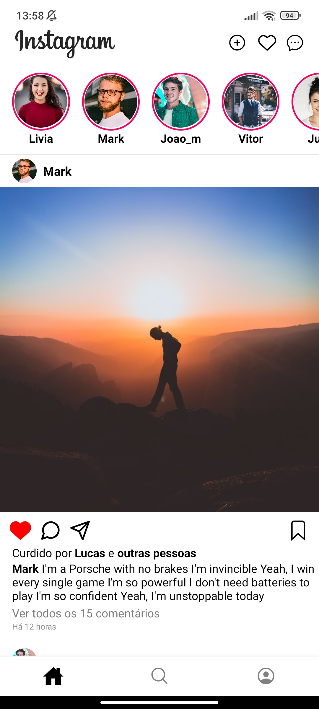
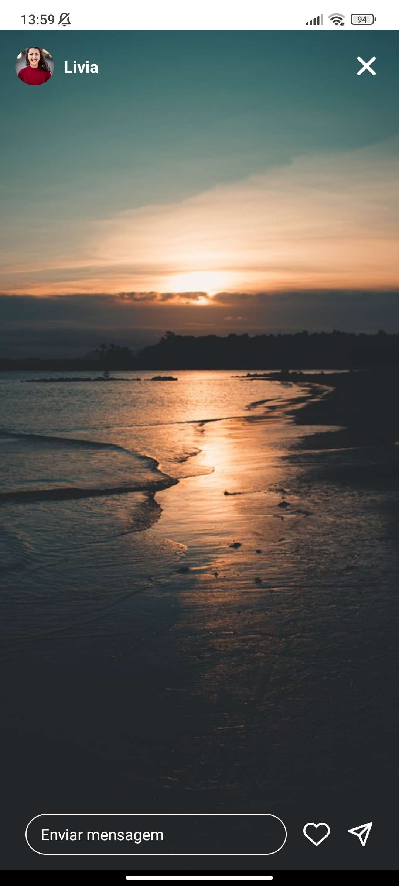
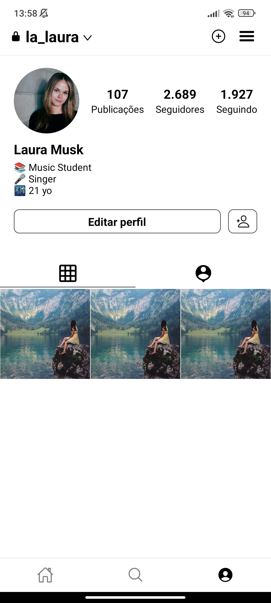

<p align="center">
  <a href="#-tecnologias">Tecnologias</a>&nbsp;&nbsp;&nbsp;|&nbsp;&nbsp;&nbsp;
  <a href="#-projeto">Projeto</a>&nbsp;&nbsp;&nbsp;|&nbsp;&nbsp;&nbsp;
  <a href="#-APK - download">Downloads</a>&nbsp;&nbsp;&nbsp;|&nbsp;&nbsp;&nbsp;
</p>

<br>

<p align="center">
   
   
   
</p>

## 🚀 Tecnologias

Esse projeto foi desenvolvido com as seguintes tecnologias:

- [React Native](https://facebook.github.io/react-native/)
- [Expo](https://docs.expo.dev/)


## 📱 Projeto

Este é um clone do app do instagram desenvolvido do 0 por mim para praticar minhas habilidades com react-native.


## 📲 Iniciar projeto

Para iniciar o projeto em seu computador faça um clone desse repositorio, e use um desses comandos para baixar as dependências:

```
yarn install
```
ou
```
npm install
```

depois use esse comando para abrir o servidor e iniciar o app: 

```
expo start
```